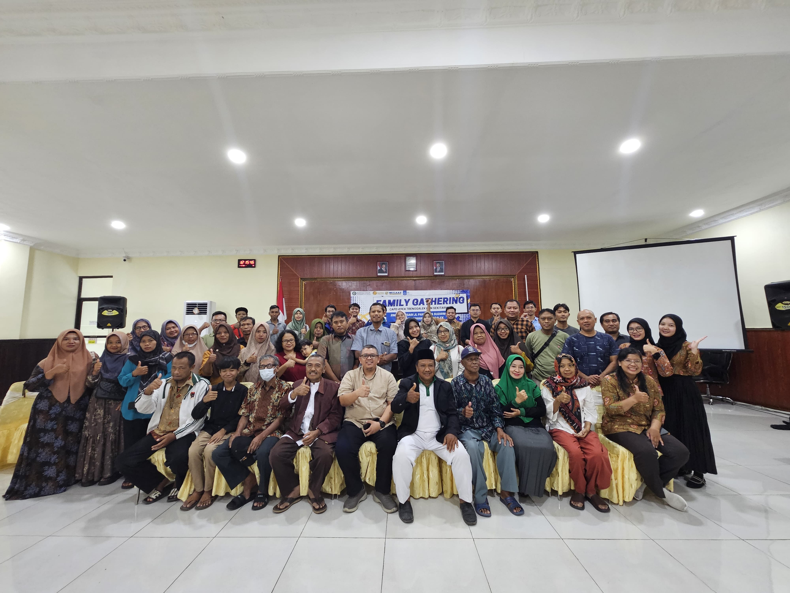
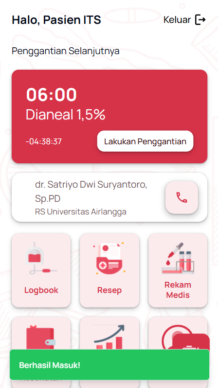

## **Monitoring Platform for CAPD Patient Supervision**

**Supervised by:** Dini Adni Navastara, S.Kom., M.Sc.

This remote monitoring platform was designed to streamline the supervision of Continuous Ambulatory Peritoneal Dialysis (CAPD) patients. The system enables medical professionals to track patient status efficiently without relying on time-consuming manual check-ins.

 

### **Key Features**

* **Real-time Activity Monitoring:** Enables doctors and nurses to monitor patient activities and adherence to dialysis procedures remotely in real-time.
* **Fluid Condition Detection:** A diagnostic feature using computer vision to detect whether the patient's effluent fluid is normal or abnormal, aiding in the early identification of potential infections.
* **Digital Medical Records:** Integrated health record-keeping to store and organize patient history, ensuring medical data is easily accessible for clinical analysis.
* **Fluid Exchange Notifications:** Automated reminders for scheduled fluid changes to ensure the dialysis cycle is maintained accurately and on time.

### **Outcome**

The application successfully enhanced remote supervision capabilities, reduced friction in recurring monitoring tasks, and improved patient safety through consistent medical oversight.