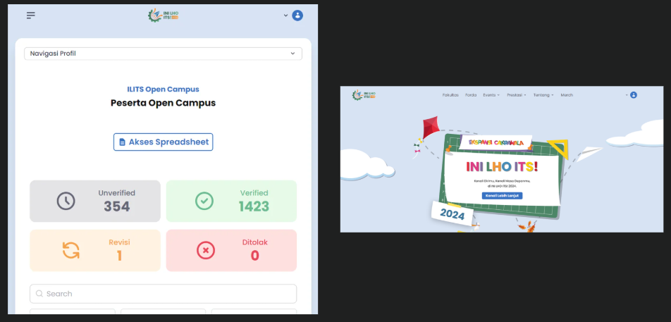

## **Ini Lho ITS 2024 Website**

Ini Lho ITS 2024 is an event website built to support event information, participant registration, ticketing, and committee operations. I worked on the project as a backend and DevOps engineer, developing the core registration and payment workflows, building administrative tools for registrant management, and improving the deployment setup so the Node.js application could handle higher traffic more efficiently.

### **Key Features**

* **Event Registration:** Built backend workflows for participant registration and ticket ordering.
* **Midtrans Payment Integration:** Integrated Midtrans to process online payments and synchronize payment status with registration data.
* **Ticket Quota Management:** Managed ticket availability to keep registration capacity accurate across multiple ticket categories.
* **Tiered Ticket Quota System:** Implemented ticket tiers where earlier registrants received better privileges or access based on availability and registration order.
* **Analytics Dashboard:** Provided dashboard analytics for monitoring participant numbers, registration progress, and payment performance.
* **Import and Export Data:** Added data import and export capabilities to support committee operations and reporting needs.
* **Registrant Management Dashboard:** Built administrative tools to review, approve, or reject registrants from the dashboard.
* **Mailgun Email Integration:** Integrated Mailgun to send transactional emails related to registration, approval status, and event communication.
* **Node.js Multi-core Optimization:** Optimized the single-threaded Node.js application to utilize multiple CPU cores through PM2 cluster mode.

### **Outcome**

The platform helped centralize registration, payment, and participant management for Ini Lho ITS 2024 while improving operational visibility for the committee and increasing backend reliability through better deployment and process management.
