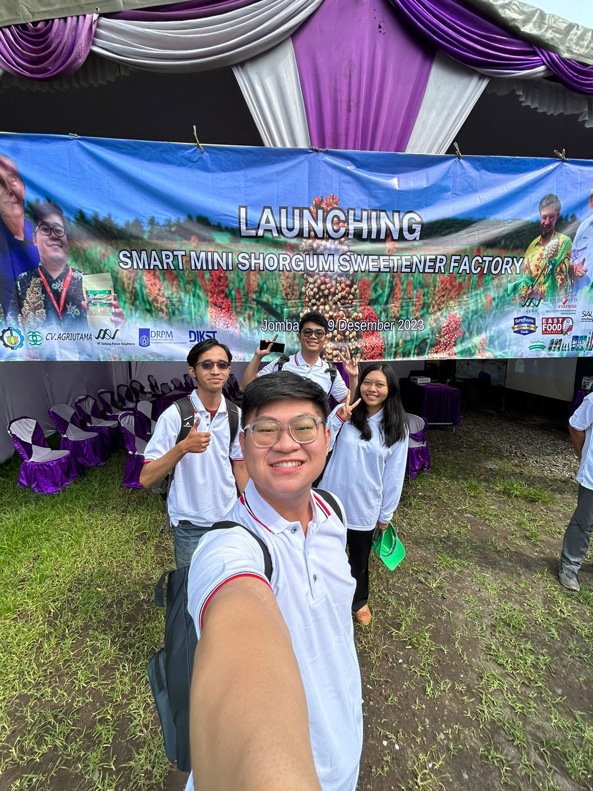

## **ITS ERP CRM SCM Validation**

**Supervised by:** Prof. Drs. Ec. Ir. Riyanarto Sarno, M.Sc Ph.D

 

 

This validation project focused on testing ERP, CRM, and SCM modules used in an enterprise operational system. The work emphasized accounting correctness, module reliability, and implementation readiness before broader operational use.

### **Key Features**

* **Full Cost Accounting Validation:** Tested ERP accounting flows against full cost accounting requirements to verify financial behavior across core business processes.
* **Module Behavior Testing:** Validated ERP, CRM, and SCM module behavior through structured testing and issue reporting.
* **Implementation Gap Analysis:** Identified mismatches between expected business requirements and delivered system behavior.
* **Dockerized Test Environment:** Used Dockerized environments to support consistent Node.js-based application testing.

### **Outcome**

The validation process improved confidence in accounting-module correctness, clarified implementation gaps, and supported more reliable enterprise-module behavior before broader operational use.
