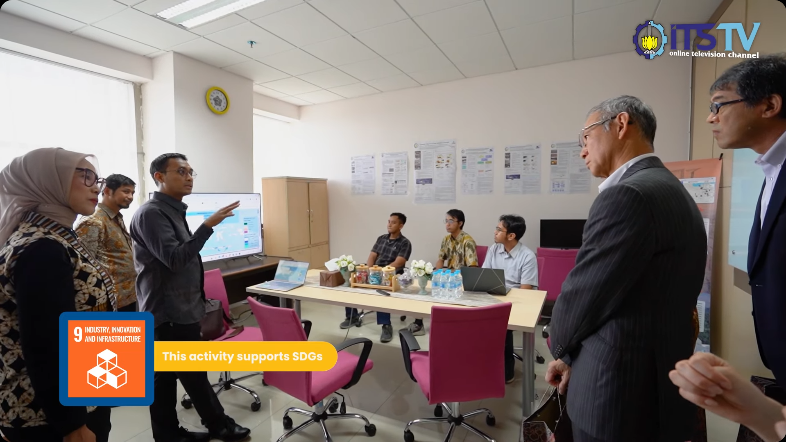

## **SAI Simulations Validation**

**Supervised by:** Prof. Dr.rer.pol. Heri Kuswanto, M.Si.

Large-scale climate data validation workflow for Stratospheric Aerosol Injection (SAI) simulation outputs. The project supported research-oriented data preparation, quality checks, and reproducible processing for high-volume climate datasets.

### **Key Features**

* **High-volume Dataset Preparation:** Prepared large climate simulation outputs for downstream validation and comparison.
* **Bias Correction Support:** Supported robust bias correction workflows across simulation outputs to improve analytical reliability.
* **Repeatable Data Processing:** Built processing steps around reproducibility so future research iterations could be inspected and extended more easily.
* **Quality-focused Validation:** Applied careful checks to make simulation outputs easier to compare across research scenarios.

### **Outcome**

The project made SAI simulation validation easier to inspect, compare, and extend, strengthening the workflow for future climate science research iterations.
