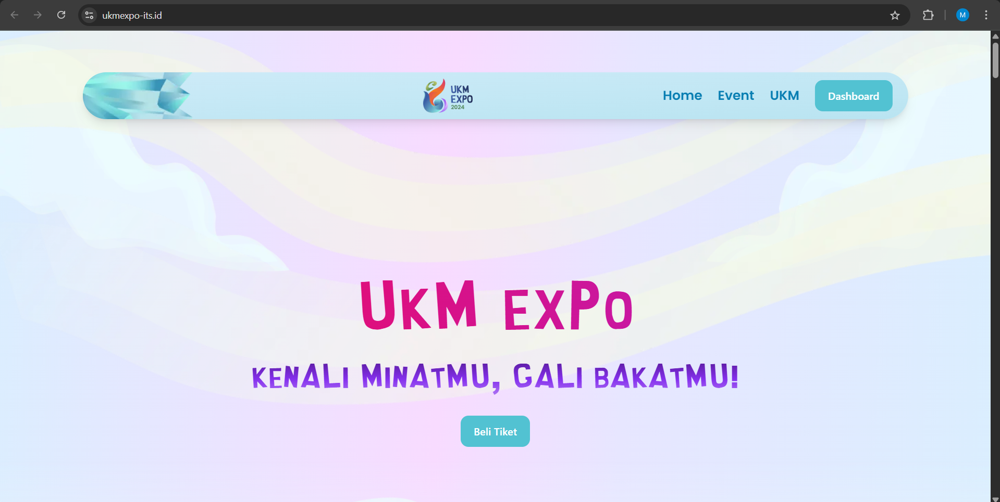

## **UKM Expo 2024 Website**

UKM EXPO is an event organized by LMB ITS to introduce Student Activity Units (UKM) to new ITS students and help them explore interests, talents, and campus communities. I designed and developed the event website to support event promotion, participant registration, and ticket sales for Day 1-2 Bazaar UKM and Day 3 Concert. The backend was built with Golang and integrated with Xendit as the payment gateway to handle online ticket purchases securely.

### **Key Features**

* **Event Registration:** Designed a registration flow that allowed participants to browse event details and register for the available event sessions.
* **Xendit Payment Gateway Integration:** Integrated Xendit to process ticket payments and synchronize successful transactions with participant and ticket records.
* **Reliable Ticket Quota Management:** Optimized the ticket quota system using locking mechanisms to maintain data consistency during high-demand purchases.
* **Automatic Quota Recovery:** Implemented automatic recovery for ticket quotas from failed or incomplete transactions, reducing the risk of overselling or permanently blocked tickets.
* **Presale Ticketing System:** Built presale ticket logic to support discounted ticket campaigns within defined sales periods.
* **Analytics Dashboard:** Provided a dashboard to monitor event participants and track the total amount of successful payments.

### **Outcome**

The website helped centralize UKM Expo registration and ticketing operations while improving payment tracking, ticket quota reliability, and event-level participant visibility for the organizing committee.
